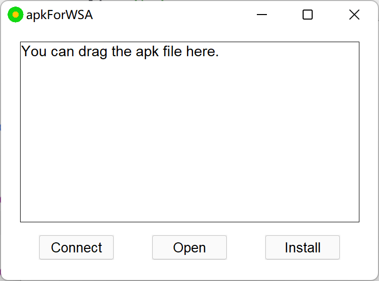

# WSA_APKInstallTool
 A simple tool for intalling apk to WSA (or other Android emulators)

## Settings
You can change the port by editing `config.json`

## Others
The program may not respond during installation.

